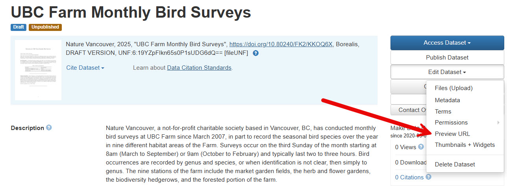

# Advanced Deposit in UBC Dataverse Collection
{: .no_toc}

 Before you continue, please make sure you have a good understanding of the deposit basics in <a href="05-1_Basic_Deposit.md" target="_blank">Basic Deposit in UBC Dataverse Collection</a>.
 {: .prereq}
 
 In this guide, we expand further on data discovery, file formats, DOIs, Preview URLs, access control, licenses, file size, version control and more.

  

    Table of Content
  

  {: .text-delta }
 - TOC
{:toc}

Looking for a cheat sheet? Check out our <a href="https://osf.io/5u4f3" target="_blank">one-pager</a>!
{: .note }

---

# Recommended File formats 

 
 

**Any kind of file** can be uploaded to Borealis, but extra functionality is supported for some file types:

## Tabular data
{: .no_toc}

Tabular data (Stata, SPSS, Excel, R, & CS) is <b>normalized to .tab</b> format on upload, as it is a non-proprietary archival format that a variety of programs can read. 

Normalization is important for long-term preservation of digital data. 
The deposited files can be downloaded in multiple formats, but always including the original. 
{: .note}

In Borealis, tabular normalization also allows you to perform statistical data exploration and visualization *right in your browser*. Click the `Data Explore` button to see what it can do. 

 
 

## Compressed Files (.zip, tar)
{: .no_toc}

Compressed files are the preferred method for uploading large datasets or many files to Borealis.

**Zip files are automatically extracted on upload**, and the contents will appear as a list under the Files tab. Folder structure and file hierarchy within the zip file are maintained on extraction.

Sometimes, it is a good idea to deposit the zipped folder to preserve the content as it is, especially if you need your files to remain together. In this case, please upload your zipped directory, and Borealis software will unzip it once upon upload.
{: .note}

 
 

 

# File Size

Borealis is not intended to handle very large datasets. Current file size limits are:
- For upload: **5GB** per file (up to 1,000 files). If you are depositing files larger than 5GB, *double-zip* your directory.
- For tabular normalization: **500MB** per file. Tabular files over this size will remain in their original format, e.g. Excel.

While there is no cap on the overall number of files that you can upload, if your individual data files exceed 10GB, please contact `research.data@ubc.ca` to discuss the best repository options, as we have other solutions (e.g. [FRDR](https://www.frdr-dfdr.ca/)).
{: .note}

 

# Access Control

Sensitive files can be <b>Restricted</b> or <b>Embargoed</b> so they are not freely available to download. Files can either be fully restricted, or set up so users can send access requests to the contact email for review.

## To restrict, unrestrict, or embargo a file:
{: .no_toc}

 
 

In the popup window, you may *describe the conditions of use* or *license for this file* in the Terms of Access box. 

 
 

Check the `Enable access request` box to allow users to send the contact person an email asking for permission to download a restricted file. Click `Save Changes` to finish.

Files can also be unrestricted if the terms change--for example, once an embargo period has passed. 

 

# Version control

Every change made to a dataset—adding files, editing metadata, etc—is saved as a new version of the dataset. This allows you to track the change history of the project, which can be viewed under the `Versions` tab. This is useful if you need to roll back to a previous version, or find out who made what changes and when.

 
 

 

# Sharing Data

## Where can UBC Dataverse Collection datasets be discovered?

Data deposited in UBC Dataverse Collection is indexed by, and integrated with, many services on the Web, including:

- <a href="https://scholar.google.ca/" target="_blank">**Google Scholar**</a>
- <a href="https://datasetsearch.research.google.com/" target="_blank">**Google Data**</a>
- <a href="https://explore.openaire.eu/" target="_blank">**The EU's OpenAIRE**</a>
- <a href="https://library.utoronto.ca/" target="_blank">**Most university libraries, like the University of Toronto**</a>
- <a href="https://datasetcatalog.nlm.nih.gov/" target="_blank">**US National Library of Medicine**</a>
- <a href="http://datacite.org" target="_blank">**DataCite**</a>
- <a href="https://orcid.org/" target="_blank">**ORCID**</a>
- <a href="https://www.lunaris.ca/en" target="_blank">**Lunaris**</a>: Canadian national research data discovery service
- **Any APIs**

## Social Media
Spread the word about your research and improve your altmetrics by sharing your linked data on social media!

Borealis provides a `Share` button for
1. Each Borealis collection
2. Each dataset

 
 

This button gives you the option to create a post with a link to your data on Facebook, Twitter, and LinkedIn.

 

## Linking to your dataset

There are two main ways to direct people to your dataset:

### *1*{: .circle .circle-blue} &nbsp;DOI
{: .no_toc}

A **a DOI (Digital Object Identifier)** is assigned to the dataset by Borealis when the first draft is created. Once the dataset is **Published**, anyone can use the DOI link to find it. While the dataset is still **unpublished**, the DOI can only be used by Dataverse *account holders* with permission to view that dataset.

Use DOIs in citations, publications, on your personal/research group websites--anywhere you want the link to your data stable over time.
{: .note}

Click <a href="https://researchdata.library.ubc.ca/plan/get-dois/" target="_blank">here</a> for more information about UBC DOIs.

### *2*{: .circle .circle-red} &nbsp;Preview URL 
{: .no_toc}

A **temporary link** for use with **unpublished** data. The dataset can only be seen by those who have the link, and users *do not need a Dataverse account*. Great for giving pre-publication access to journals, reviewers, and collaborators.

To create a Preview URL, click `Edit Dataset > Preview URL`. The generated URL can be accessed from this location until the dataset is published, so you can copy it again and again as needed. The Preview URL will automatically disappear once the dataset is published.

Preview URL can also be anonymized, e.g. names, affiliations, ORCIDs, etc would be masked.  

 

 

## Licenses and Terms

You have control over how your data can be used. Borealis allows for a variety of licenses and terms of use.

### **Built-in License Templates** 
{: .no_toc}

Templates can be selected at dataset creation, and changed at any time. These automatically apply the right information about the license to the dataset’s metadata.

 

You can use <a href="https://copyright.ubc.ca/creative-commons/" target="_blank">UBC Library Creative Commons page </a>  to decide what license to use with your dataset. We recommend **CC-BY or CC-0** license.  
{: .note }

### **Custom license**
{: .no_toc}

One-size-fits-all licenses don’t suit every dataset. You can create customized terms and conditions of use. 

To customize terms: 

 

If you need help creating a custom license, contact `research.data@ubc.ca`.

 

# Congrats!
{: .no_toc }

You are an expert in data deposit in the UBC Dataverse collection now! 

If you need have more options to customize and control the way your Dataverse collections look and act, you need to know more! Check out our <a href="05-3_Admin_Access.md" target="_blank">Admin Access in the UBC Dataverse collection workshop</a>.

---

Need help?
{: .label .label-blue }
  Please reach out to `research.data@ubc.ca` for assistance with any of your research data questions.

