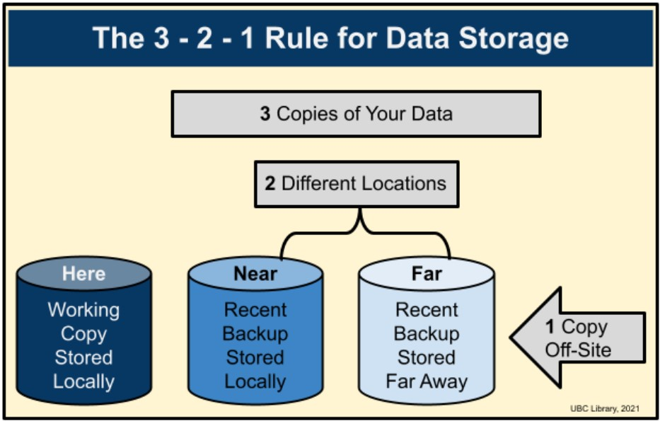

# Storage and Backup
{: .no_toc}

Data storage and security considerations are essential aspects of managing research data and should be mapped out in your DMP. The following good practices are recommended for you to implement in your project and noted in your DMP.

  

    Table of Content
  

  {: .text-delta }
 - TOC
{:toc}

---

## Estimate the Storage Space
At the beginning of any project, researchers should *estimate the required storage space* during the active phases of your project. This estimation should take into consideration factors such as file versioning, backups, and potential data growth. In deciding where to store your data, ensure that you understand your *organization's policies and infrastructure for data storage and backups*. This includes considering the most appropriate storage system for <a href="https://arc.ubc.ca/arc-research-cybersecurity-and-privacy-services">sensitive data </a>and what institutional policies apply to its handling.

 

## Retain the Raw Data
An essential step in data storage is to retain an original, unedited copy of your raw data file. This file should be locked in a read-only format, which requires copying the file to make changes. It is imperative that you do not overwrite this file so you have a fail-safe to return to should something go awry.

 

## Follow the 3-2-1 Backup Rule 

### "I have saved my data. Is it safe?"
{: .no_toc}

The short answer is no &nbsp; &nbsp;. 

Data can be lost for a number of reasons including:
- hardware failures
- software failures
- viruses or hacking
- power failures
- natural disasters
- human error
- theft of equipment

 

 &nbsp;The best practice is to follow the 3-2-1 backup rule, which entails maintaining  **three copies** of your data stored in at least **two locations** (in case of a failure at one location), **one of them off-site**. Even if each location is a cloud-based server, do not store all of your backups on the same cloud-based server as a precaution. Cloud-based servers do have internal redundancies to prevent the loss of data, but *utilizing multiple services* is a good practice in the off-chance of a catastrophic loss.

 

## Back up All 
The backup copies should include all pertinent files, *including your README files*. Backing up the entire package of stored data helps ensure that everything can be understood in the future.

 

## Update the Backups Regularly

Even if you are backing up your data, remember to check that the backups are working and that the data is accessible. *Every time you edit your working copy, the backup copies should be updated!* A backup copy from 6 months ago that contains none of your recent data is practically useless. 

Stating a well-defined data backup schedule in your plan is essential, with **automatic backups** being the most ideal. Certain data storage options at UBC, such as **TeamShare** or **Home Drive**, already have automatic backup features in place. Consider leveraging these existing backup mechanisms to ensure data integrity and reliability.

### Storage Resources

**OneDrive** is an excellent and the simplest solution for data storage needs for most UBC researchers. Just don't forget to back up your data in one more location. 
{: .note }

Per <a href="https://cio.ubc.ca/information-security-standards/U3" target="_blank">UBC Information Security Standard U3</a>, sharing platform such as **DropBox and Google Drive** should not be used to share research information, as they are **not** UBC approved tools.  
{: .warn}

| UBC-IT Storage Resources | Notes |
| - | - |
|<a href="https://it.ubc.ca/services/web-servers-storage/educloud-server-service" target="_blank">**EduCloud Server Service**</a>|cost associated, need IT skills|
|<a href="https://it.ubc.ca/services/web-servers-storage/teamshare-storage-service" target="_blank">**Teamshare**</a>|Internal fileshare, costs per GB per year|
|<a href="https://it.ubc.ca/services/web-servers-storage/microsoft-onedrive" target="_blank">**OneDrive**</a>|free 1TB of storage per user|
|<a href="https://it.ubc.ca/services/web-servers-storage/home-drive-storage-service" target="_blank">**Home Drive**</a>|personal storage only, up to 20GB|
|<a href="https://it.ubc.ca/services/web-servers-storage/sharepoint-software-service" target="_blank">**SharePoint**</a>|powerful, but complicated to develop, cost associated|

More Details
{: .label .label-blue}

For more detailed comprison among these UBC IT resources, you can refer to their <a href="https://it.ubc.ca/sites/it.ubc.ca/files/UBC%20Online%20Storage%20Solutions%20-%20Features%20Comparison%20Chart.pdf" target="_blank">Comparison Chart</a>.

| UBC ARC Storage Resources | Notes |
| - | - |
|<a href="https://arc.ubc.ca/chinook" target="_blank">**Chinook**</a>|Object storage application, free for UBC researchers, need to apply to use via UBC ARC|
|<a href="https://arc.ubc.ca/arc-cloud-platform-ubc-arc-ronin" target="_blank">**RONIN**</a>|allows to harness powerful AWS cloud infrastructure|

 

| Digital Research Alliance of Canada (The Alliance) Storage Resources | Notes |
| - | - |
|<a href="https://docs.alliancecan.ca/wiki/Nextcloud" target="_blank">**NextCloud**</a>|100Gb free per user, similar to Dropbox|
|<a href="https://docs.alliancecan.ca/wiki/Storage_and_file_management/en" target="_blank">**System storage**</a>| Linux based for supporting high-performance computing (HPC) analysis, up to 10Tb per research group|

 

## Team Access Management
To facilitate collaboration and teamwork, it is a good practice to outline in your DMP how your collaborators or research team will access, modify, contribute, and work with the data. Describe how collaborators or research teams will be able to access, modify, contribute, and work with your data. Access should be provided per the [Principle of least privilege](https://cio.ubc.ca/information-security/policy-standards-and-resources/information-security-standards-glossary).  

 

## Data Security 
Safeguarding your research data throughout its lifecycle is paramount. Provide a brief overview of the security measures, controls, procedures, and processes that will be implemented to protect your data. This includes outlining the **security controls** that will be in place, as well as any specific **privacy considerations**. 

Please explain your data risk classification.  You can consult [UBC ARC’s Research Information Classification](https://arc.ubc.ca/security-privacy/research-information-classification) to help you classify your research data.

For comprehensive guidance on security and privacy planning for research at UBC, you can refer to the wealth of resources available at <a href="https://arc.ubc.ca/planning-research-security-and-privacy" target="_blank">UBC ARC's website</a>.
{: .note }

 

# Congrats!
{: .no_toc}

By addressing these aspects and incorporating them into your data management plan, you can ensure the efficient and secure handling of your research data from storage and collaboration to backup and security measures.

---

Need help?
{: .label .label-blue }
  Please reach out to `research.data@ubc.ca` for assistance with any of your research data questions.
