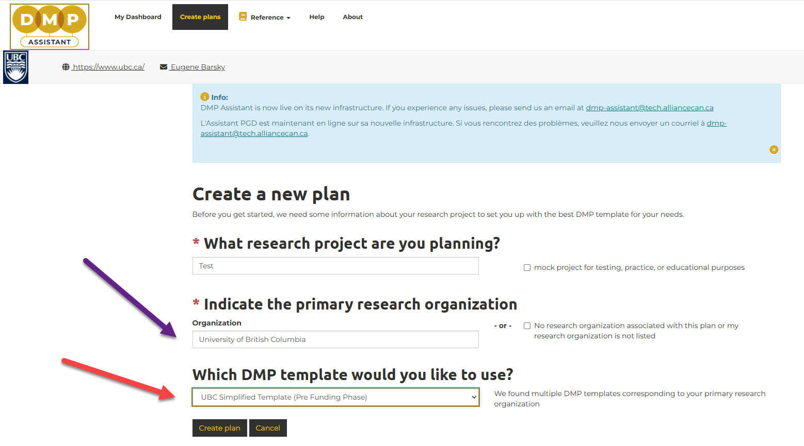

  

    Table of contents
  

  {: .text-delta }
 - TOC
{:toc}

Looking for a cheat sheet? It is coming very soon!
{: .note }

# UBC Simplified Template (Pre-Funding Phase)

This guide is designed to help you with the "UBC Simplified Data Management Plan Template (Pre-Funding Phase)" provided by the University of British Columbia.

Designed for research teams **applying for** grant funding, this short template helps plan the research data lifecycle. The DMP template was developed by the Digital Research Alliance of Canada Data Management Planning Expert Group (DMPEG) and updated for UBC researchers by campus-wide DMP Working Group in May 2025 as part of [UBC’s Research Data Management Strategy](https://rdm.ubc.ca/about/ubc-rdm-strategy) Implementation.

This simplified pre-award data management plan (DMP) template supports researchers in meeting DMP requirements during funding applications. It focuses on key questions and guidance relevant to this stage. [More detailed DMPs](https://ubc-library-rc.github.io/rdm/content/06_Data_Management_Plan.html) may be needed after funding is awarded and throughout the research lifecycle.

Before creating your DMP, consider:

**Policies and requirements**:
Familiarize yourself with UBC's relevant policies and requirements, including funder and university policies, ethical guidelines (e.g., TCPS2), community or organization-specific requirements (e.g., Indigenous ethics boards), and publisher or journal policies. Your data management must comply with these.

**Guiding principles**:
Ensure your data management supports open science principles, especially the [FAIR principles](https://www.go-fair.org/fair-principles/), which emphasize that data should be findable, accessible, interoperable, and reusable.

# Tools to Create DMPs in Canada - DMP Assistant 

To create your DMP, please use  <a href="https://dmp-pgd.ca/" target="_blank"><u>DMP Assistant</u></a>{: .btn .btn-blue }. 

This is a free, open-source Canadian tool created by the Portage network (now supported and funded by the Digital Research Alliance of Canada) for preparing DMPs. It is available in *both English and French* and allows you to create and export your DMP. 

Choose the **UBC Simplified Template** from the list of available templates. 
This tool follows best practices in data stewardship in Canada and walks researchers step-by-step through key questions about data management. 

DMP Assistant is designed to meet the requirements of these Canadian funders:
- Canada Foundation for Innovation (CFI)
- Canadian Institutes of Health Research (CIHR)
- Natural Sciences and Engineering Research Council (NSERC)
- Social Sciences and Humanities Research Council (SSHRC)

# Ethical, Legal, or Commercial Considerations

Consider how you will manage data across your project, from collection to long-term stewardship. Plan how you will safeguard sensitive information, comply with funder and ethics requirements, and address any legal or commercial obligations. Discuss how will the research data be effectively protected throughout the lifecycle of your research project. Different safeguards may be required depending on the relevant [Research Information Classification](https://arc.ubc.ca/security-privacy/research-information-classification).

Research involving human participants often requires informed consent and ethics approval, especially when data will be shared. If your project involves external partners (e.g., industry, government, or non-profits), outline any agreements on data use and consult Innovation UBC for guidance. Also consider any intellectual property (IP), research security, or knowledge mobilization needs. UBC offers expert support and infrastructure to help navigate these requirements.

**Helpful UBC Links**

- [Clinical Research Ethics](https://researchethics.ubc.ca/clinical-research-ethics)  
- [Behavioural Research Ethics (BREB)](https://researchethics.ubc.ca/about-behavioural-research)  
- [Okanagan BREB](https://ors.ok.ubc.ca/ethics-compliance/research-ethics/)  
- [Research Information Classification](https://arc.ubc.ca/security-privacy/research-information-classification)  
- [Research Security Policies](https://researchsecurity.ubc.ca/federal-policies-research-funding/grants-covered-federal-policies)  
- [Innovation UBC – Sponsored Research](https://innovation.ubc.ca/sponsored-research)  
- [UBC Knowledge Exchange](https://kx.ubc.ca/)

# Describing Your Research Data

Research data refers to any information collected, observed, generated, or acquired to validate your research findings. This can include data files, questionnaires, transcripts, samples, physical collections, software, models, algorithms, lab notebooks, codebooks, methodologies, workflows, and other materials created during the project.

When describing your data, consider including the following:

- **Data types**: Specify whether the data is textual, numerical, image-based, audiovisual, or another format.
- **Collection or source**: Briefly explain how the data will be collected or generated. If reusing existing data, include the source—such as citations, websites, persistent identifiers, or acquisition requests—and specify what will be used.
- **Security and risk**: Identify any potential risk to research participants if data is lost, stolen, or compromised, and describe the safeguards in place. Different safeguards may apply depending on UBC’s [Research Information Classification](https://arc.ubc.ca/security-privacy/research-information-classification).
- **Indigenous data**: Note if the data involves Indigenous communities or knowledges (see more information in the dedicated section below).
- [**Data format**](https://ubc-library-rc.github.io/rdm/content/02_file_formats.html): Indicate if the data is in a proprietary or non-proprietary format.
- **Data size**: Estimate the total size of your data, accounting for raw, master, and processed versions.
- **Tools**: List any tools, software, or solutions you will use for data collection and analysis.

 
# Documenting Your Data for Reuse and Validation

Describe how your data will be documented to ensure it is clear, accurate, and understandable throughout the research process and for future reuse or validation. Good documentation supports transparency, reproducibility, and long-term utility.

If applicable, identify any data or metadata standards that will be used in your project. Structured documentation—such as [data dictionaries](https://ubc-library-rc.github.io/rdm/content/07_data_dictionary.html), codebooks, [README files](https://ubc-library-rc.github.io/rdm/content/03_create_readme.html), lab or field notes, code/syntax, and user guides—helps others understand and use your data. 

Metadata standards provide a consistent set of descriptive fields (like a controlled vocabulary) to capture contextual information about your data. These standards typically use open, machine-readable formats (e.g., JSON, XML) and support interoperability across software and systems. Using metadata standards enhances data discoverability and sharing in repositories or databases.

Consider how documentation will be created and maintained: Will it be automated, scripted, or user-generated? Who will be responsible for it? Clarifying these roles can help inform staffing and budgeting considerations for your project and grant applications.

For support with documentation strategies and identifying appropriate metadata standards, connect with the [UBC Library](https://researchdata.library.ubc.ca/), which offers guidance and resources tailored to your research needs.

# Data Storage and Access During Active Research Phase

Describe where and how your research data will be stored, accessed, and managed during the active phases of your project. This includes all data versions (e.g., raw, master, analytical), all activities (e.g., collection, processing, analysis), and all tools or platforms used for storage.

Consider:

- Who will need access (e.g., co-investigators, research staff, students, or external partners)
- What security measures will be in place to protect the data
- How and where data will be backed up to prevent loss

Principal Investigators must ensure secure, role-based access for team members and determine how each will work with the data. Storage solutions should be selected based on the [Research Information Classification](https://arc.ubc.ca/security-privacy/research-information-classification) of the data.

If your research involves human participants, follow the relevant ethics guidelines from the [Clinical Research Ethics Board](https://researchethics.ubc.ca/clinical-research-ethics), [Vancouver BREB](https://researchethics.ubc.ca/about-behavioural-research), or [Okanagan BREB](https://ors.ok.ubc.ca/ethics-compliance/research-ethics/).

UBC offers several storage options tailored to research needs. Use the [ARC Research Storage Finder Tool](https://arc.ubc.ca/compute-storage/ubc-research-storage-finder) or consult your local IT support to determine the most appropriate solution.

  
# Protecting Your Research Data

Describe the security and access controls that safeguard your data from unauthorized access, modification, or deletion.

Research data can be targeted by malicious actors. Poor protection risks your collaborators, participants, research integrity, and reputation. Consider your data’s nature and risk classification.

Include these security controls in your description:

- Access management: Restrict roles and access.
- Technical controls: Authentication, network protection, threat detection, and response.
- Physical controls: Location and device protection where applicable.
- Administrative controls: Procedures, processes, policies, and standards.

For guidance, consult UBC’s [ARC Research Cybersecurity and Compliance team](https://arc.ubc.ca/security-privacy/planning-research-security-and-privacy-mind).

UBC Campus Security offers a [site security assessment](https://security.ubc.ca/home/our-services/site-security-assessment/) to help with physical access controls on the Vancouver campus.

This information may also be used for any relevant Risk Assessment Forms required by research security guidelines.

 

# Making Data Discoverable and Accessible For Long-Term (FAIR Data)

Describe your plans for managing data after active research ends, including data deposit and sharing. Explain how you will ensure your data remains discoverable and accessible beyond the research phase, addressing:

- Obligations and policies from funders, partners, publishers, or UBC
- Whether any data will be destroyed and under what conditions
- If any data is sensitive, requiring ethics approval or de-identification before sharing
- The need for software, code, scripts, or metadata to enable access and interpretation

Will you deposit data in a digital repository for open discovery, controlled access, and reuse?

- If yes, specify where you will deposit it (if known)
- If no, explain why the data won’t be deposited

When depositing data, consider repositories that assign Digital Object Identifiers (DOIs) to improve discovery and citation.

Two Canadian repositories supported by UBC are:

- [Borealis](https://researchdata.library.ubc.ca/deposit/dataverse/): A national, bilingual, multidisciplinary, secure repository, curated and funded by UBC Library
- [Federated Research Data Repository (FRDR)](https://researchdata.library.ubc.ca/deposit/frdr/): Supports very large data deposits (in TBs), curated and funded by the Digital Research Alliance of Canada

The [UBC Library](https://researchdata.library.ubc.ca/) offers data curation services to help format and document data, enhancing long-term value.

UBC Library can also assist with planning your project’s long-term data management, including resources, expertise, and repository options.

# Indigenous Data Governance

If your research involves Indigenous communities, follow all ethical and policy obligations, including best practices outlined by [Tri-Agency frameworks](https://ethics.gc.ca/eng/tcps2-eptc2_2022_chapter9-chapitre9.html) and any relevant university or partner policies. Your data management plan should be led by the Indigenous communities, collectives, and/or organizations (ICCOs) involved.

Key guiding principles and resources include:

- [CARE](https://www.gida-global.org/care): Promotes collective benefit, authority to control data, and responsible, ethical research with Indigenous communities.
- [OCAP](https://fnigc.ca/ocap-training/)®: Asserts the right of First Nations to Ownership, Control, Access, and Possession of their data.
- [National Inuit Strategy on Research](https://www.itk.ca/wp-content/uploads/2018/04/ITK_NISR-Report_English_low_res.pdf): Sets out principles for respectful and reciprocal research with Inuit communities.
- [Principles of Métis Ethical Research](https://achh.ca/wp-content/uploads/2018/07/Guide_Ethics_NAHOMetisCentre.pdf): Provides six principles for research with Métis people.

Community-specific resources may also be relevant. Early engagement with ICCOs helps ensure your project aligns with Indigenous data sovereignty best practices.

Clarify who will manage data collection, analysis, storage, security, and long-term stewardship. Responsibilities may be shared across PIs, co-investigators, trainees, collaborators, or institutions. Plan for staff changes and document how continuity will be maintained.

Assess the resources needed for data management—such as dedicated staff or outsourced services—and how these will be funded. Incorporate related costs into your research budget (e.g., compensation for Indigenous collaborators/participants).

**Helpful links:**

- [UBC Indigenous Research Support Initiative](https://irsi.ubc.ca/)

- [UBC Research Ethics: Indigenous Research and Ethics Review](https://researchethics.ubc.ca/behavioural-research-ethics/indigenous-research-and-ethics-review)

  

Need help?
{: .label .label-blue }
  Please reach out to `research.data@ubc.ca` for assistance with any of your research data questions.
