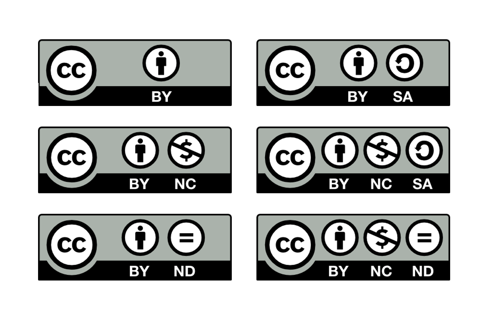
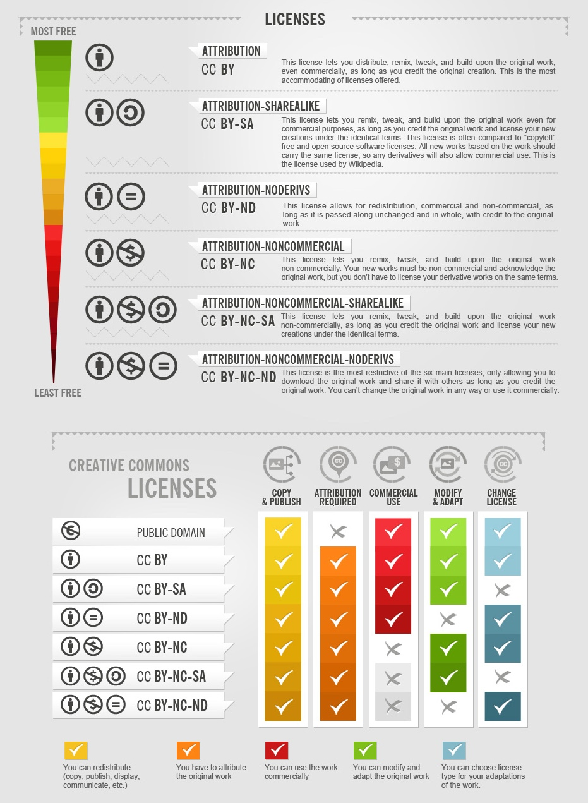
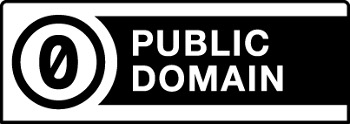

# Licensing Your Research Data
{: .no_toc}
It's great that you want to share your research to support open research initiatives. However, not everyone is comfortable waiving their copyright over their work. Using a license is a good way of communicating permission to potential users on how your work can be used. It ensures you're getting the proper credit for your work when sharing it.

There are many types of licenses for various kinds of products, contexts, and disciplines. Each has its own unique purpose, policies, and legal protection. Choosing the best license depends on your preferences and the nature of your work. 

Looking for a cheat sheet? Check out our [one-pager](https://osf.io/jz5ur) 
{: .note}

  

    Table of contents
  

  {: .text-delta }
 - TOC
{:toc}

---

## Warm-up
{: .no_toc}
{: .label .label-green }

Before proceeding, let's try to answer these questions:
1. Take a look at this workshop page. Can you use the information openly?
2. What about this dataset? Can you use the data freely?

Access the dataset here:
>Binfield, Lucy, 2025, "Student perceptions of waste sorting interventions, and participation rates in interventions, in high-density student housing", [https://doi.org/10.5683/SP3/POXHD6](https://doi.org/10.5683/SP3/POXHD6), Borealis, V1

--- 

# What is copyright?
Copyright is a legal concept where an individual or an organization, the copyright holder, has the right to control what becomes of their work, such as:
- Reproductions
- Performances
- Publications
- Adaptations
- Translations
- Telecommunications

In other words, the copyright holder gets to *control* how users can use their work. A copyrighted work can be used with the author's permission or by user rights, as outlined in [Canada's Copyright Act](https://laws-lois.justice.gc.ca/eng/acts/C-42/). Another way users can be permitted to use copyrighted work is through licenses. 

## What can't be copyrighted?
What can't be copyrighted is more complicated. Works that don't have enough "originality" may not be protected by copyright. For example, some forms of data analysis may not be "creatively" driven and can't be protected by copyright. Another example is when research is replicated using the original raw data to reproduce the results. Neither the original data nor the reproduced data is copyrightable.

Solid examples include:
- Facts
- Ideas
- Procedures
- Methods of operations, math concepts
- Raw data
- Simple visualisations, like simple line graphs

## Why is raw data not copyrightable?
{: .no_toc}
Raw data itself doesn't meet the threshold for copyright protection. However, as a counterbalance, expressions of raw data in an original way can benefit from copyright protection and licensing. 

Copyrighting raw, factual data would hinder academic, scientific, intellectual, and artistic freedoms, in addition to obstructing research transparency and replicability. Having factual information freely available improves the learning and knowledge of a discipline.

## What can be copyrighted?
An original, unique work produced by a creator can be protected by copyright. Most of the time, creative products of research can be covered by copyright. 

Copyrighted things could be:
- Complex visualisations, like infographics and pamphlets
- Research papers
- Tutorial videos
- Presentation slides
- Datasets
- Databases

# Creative Commons licenses
[Creative Commons (CC)](https://creativecommons.org/mission/) is a non-profit organization that issues standardized and free licenses to protect your work when you share it. CC licenses are recognized and applicable internationally. 

CC licenses help users know what can and cannot be done with your work without having to be in direct contact or communicate with you. They are a way of giving users permission to use your work properly under copyright law. Don't worry, CC licenses won’t remove the copyright of the work.

Here are the license terms that are used in CC licenses:
- BY: attribution
- SA: share alike
- ND: no derivatives
- NC: non-commercial use

There are many kinds of [CC licenses:](https://creativecommons.org/share-your-work/cclicenses/)

| **CC license** | **What it indicates** |
|----------------|-----------------------|
| CC BY | Give credit to the creator. |
| CC BY-ND | Give credit to the creator but can’t derive (remix) or adapt the work. |
| CC BY-NC | Give credit to the creator and only use the work for non-commercial purposes. | 
| CC BY-SA | Give credit to the creator and you can adapt (remix) the material, but using the same licenses as the original work. |
| CC BY-NC-SA | Give credit to the creator, only use the work for non-commercial purposes, and can adapt (remix) the material, but using the same licenses as the original work. | 
| CC BY-NC-ND | Give credit to the creator, can’t derive (remix) or adapt the work, and only use the work for non-commercial purposes. | 

Different CC licenses have varying levels of freedom and control, with some being more restrictive (less free) and others being more open. For example, CC BY is the license that allows many things (remixing, adding upon the work, free distribution, and commercial use), while CC BY-NC-ND is the license that has many restrictions (doesn’t allow for commercial use and remixing or modification). 

  

 
[Image](https://foter.com/blog/how-to-attribute-creative-commons-photos/) from How to Attribute Creative Commons Photos by Foter, used under CC BY-SA. 

### A "derivative" work: Are you making a smoothie?
{: .no_toc}
Are you taking things from many places and making something new, like a smoothie? Then it would be considered a “derivative” work. However, it’s still good to give credit to the parts you used to make your derivative work. 

### CC BY-ND: Why this license may not be the best for researchers working with data
{: .no_toc}
Under this license, research outputs can’t be remixed (new works derived from the original copyrighted work), which is, in many cases, counterproductive to sharing research data. 

## How can I apply a CC license?
To apply a CC license, you need to be the copyright owner of the work. If you don’t have copyright ownership over a portion of the work you’re licensing, then you need to obtain special permission from the owner of that work.

Remember that you need to be specific about what part(s) of your work are being CC licensed (if the work contains third-party copyrighted material and the work isn’t 100% yours). 

## Which CC license do I choose?
Selecting a CC license depends on your preferences and the nature of your research:
- How much freedom do you want users to have?
- How much control do you want?
- How much access and use by users are appropriate for the subject of your research? 
- Do you want others to attribute you? Do you not want others to make derivatives? Do you want to allow users to make money off your work (commercial use)?

The Creative Commons also [provides a tool](https://creativecommons.org/chooser/) that can help you choose the right license. 

The [Borealis data repository](https://researchdata.library.ubc.ca/deposit/dataverse/) is supported by the UBC Library to allow the application of any suite of the CC licenses. You can also consult [UBC's Creative Commons Guide](https://copyright.ubc.ca/creative-commons/) for more detailed information about CC licenses.

## CC0 Universal 
What does CC0 indicate? CC0 is not a license, but instead a public domain dedication tool that indicates the creator giving up copyright for their work and releasing it into the public domain. A work may also enter the public domain if the copyright protection expires. Copyright protection for works will expire 70 years after the calendar year in which the creator's death occurred. Therefore, the work is no longer protected by copyright, and it can be used openly for any purpose. Users can distribute, remix, adapt, add to the work, and more, unconditionally. 

What does CC0 do? It does many things than just give up copyright:
- Waives copyright and any other rights
- If there are rights that the right holder cannot waive under applicable law, they are licensed in a way that mirrors as closely as possible the legal effect of a waiver
- If there are any rights that the rights holders cannot waive or license, they affirm that they will not exercise them, and they will not assert any claim with respect to the use of the work

More information about the public domain and the duration of copyright protection for certain kinds of work can be found [here](https://copyright.ubc.ca/public-domain/).

 

## Exercise 1
{: .no_toc}
{: .label .label-green }

Let's now have a try at practicing the knowledge we've learned so far. Of these datasets provided, which can and can't be used based on these 2 scenarios:
1. Using it for a systematic review analysis
2. Using it to create a small startup business

Access the datasets here:
>Azadian, Amin; Protopopova, Alexandra, 2025, "Replication Data for: Stability in Cognitive and Behavioural Performance Varies Between Dog Breed Clades", [https://doi.org/10.5683/SP3/8MC0X2](https://doi.org/10.5683/SP3/8MC0X2), Borealis, V1

>Hives, Benjamin; Bruno D. Zumbo; Mark R. Beauchamp; Yan Liu; Eli Puterman, 2025, "COVID-19 Pandemic and Exercise (COPE) Trial: Engagement with exercise apps and psychological stress", [https://doi.org/10.5683/SP3/SJYOUF](https://doi.org/10.5683/SP3/SJYOUF), Borealis, V1

>Ali, Naila; White, Hailie; Min, Jason; Leung, Larry, 2025, "Pharmacy Program in a BC First Nation: Perspectives of Patients, Clinicians, and Student Learners in a Rural and Remote Indigenous Context", [https://doi.org/10.5683/SP3/TAWTOV](https://doi.org/10.5683/SP3/TAWTOV), Borealis, V2

# Open Government Licenses
Open Government Licenses (OGLs) allow users to use government data openly. Applying an OGL supports and encourages policies related to government transparency and accountability, such as BC’s Open Information and Open Data [policy](https://www2.gov.bc.ca/gov/content/data/policy-standards/data-policies/open-data). 

Different levels of government of different provinces and territories have their own version of an OGL. The Open Government Licenses can be very similar to one another, but they can vary by attribution name and information provider. 

Here are some examples of data portals by various levels of government:
- [OGL-Canada](https://search.open.canada.ca/opendata/) version 2.0
- [OGL-BC](https://catalogue.data.gov.bc.ca/) version 2.0
- [OGL-Vancouver](https://opendata.vancouver.ca/pages/home/) version 1.0

 

**Here's a breakdown of what we covered:**
Licensing and copyright can only be applied to things that are products of creative or unique intellectual activity. Licenses like Creative Commons and Open Government Licenses help to concisely communicate how to use a work properly and legally within the copyright framework. The level of permission can vary — some licenses openly allow modification and commercial use, while some don’t. Choose the license that best suits your preferences and the subject for your research output.
{: .note}

# Congrats!
{: .no_toc }
*Hooray!* You now know about copyright and licensing in a research data context, and can communicate to users how you want your work to be properly interacted with.  

 

---

### Sources
{: .no_toc} 
- Creative Commons. About CC Licenses. [https://creativecommons.org/share-your-work/cclicenses/](https://creativecommons.org/share-your-work/cclicenses/) 
- Government of British Columbia. Open Data Policy. [https://www2.gov.bc.ca/gov/content/data/policy-standards/data-policies/open-data](https://www2.gov.bc.ca/gov/content/data/policy-standards/data-policies/open-data) 
- Harvard Biomedical Data Management. Intellectual Property. [https://datamanagement.hms.harvard.edu/share-publish/intellectual-property](https://datamanagement.hms.harvard.edu/share-publish/intellectual-property)  
- Labastida, I. & Margoni, T. (2020). Licensing FAIR Data for Reuse. [https://doi.org/10.1162/dint_a_00042](https://doi.org/10.1162/dint_a_00042) 
- Ray, J. M. (2014). Research Data Management : Practical Strategies for Information Professionals. 6. Copyright, Open Data, and the Availability-Usability Gap: Challenges, Opportunities, and Approaches for Libraries. [https://ebookcentral.proquest.com/lib/ubc/detail.action?docID=3120304](https://ebookcentral.proquest.com/lib/ubc/detail.action?docID=3120304) 
- SFU Library. Data and Copyright. [https://www.lib.sfu.ca/help/academic-integrity/copyright/authors/data-copyright#how-does-copyright-apply-to-data](https://www.lib.sfu.ca/help/academic-integrity/copyright/authors/data-copyright#how-does-copyright-apply-to-data)
- UBC Scholarly Communications and Copyright Office. Creative Commons Guide. [https://copyright.ubc.ca/creative-commons/](https://copyright.ubc.ca/creative-commons/)
- UBC Scholarly Communications and Copyright Office. Public Domain. [https://copyright.ubc.ca/public-domain/](https://copyright.ubc.ca/public-domain/) 

---

Need help?
{: .label .label-blue }
  Please reach out to `research.data@ubc.ca` for assistance with any of your research data questions.

