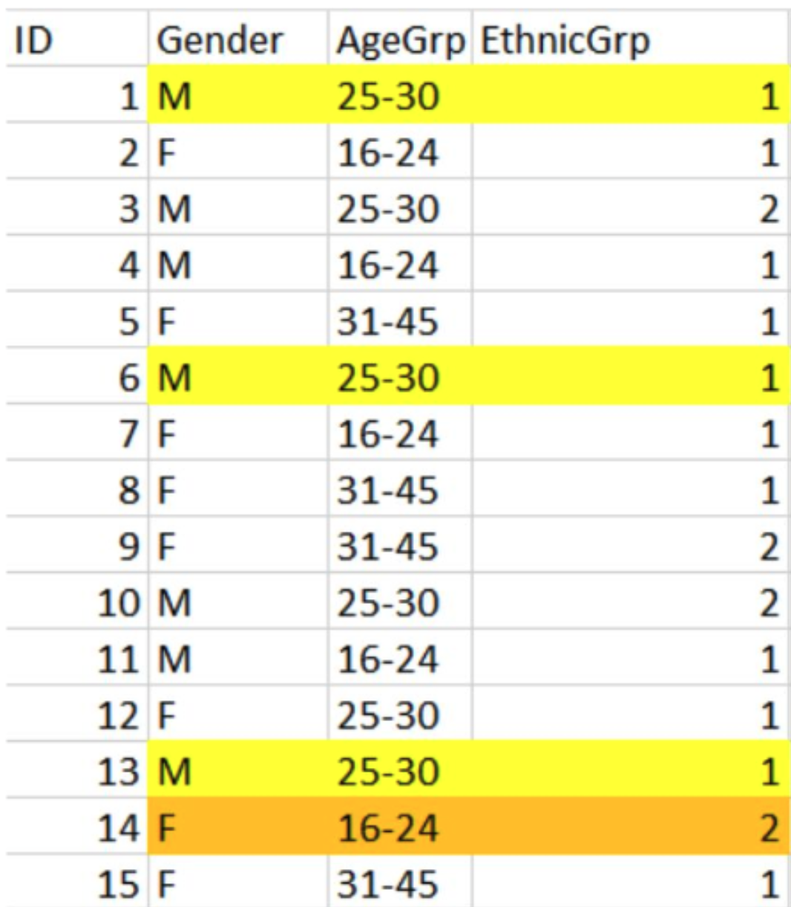

# Introduction to Data Anonymization
{: .no_toc}
Although it is good practice to share our research data and findings, we need to consider precautions when conducting ethical, reliable, and responsible research. 
Sensitive data requires careful handling and security to protect participant privacy and confidentiality and to comply with ethical and legal requirements. Leaked sensitive data poses major harm and risks, such as revealing identities, which negatively affect the interests of people, communities, and/or animals involved in the research.

### Terminology
{: .no_toc}
In UBC terminology [(Information Technology Standard U1)](https://cio.ubc.ca/information-security-standards/U1), sensitive data is classified as medium risk, high risk, or very high risk. For the purposes of this workshop, however, we will use the term “sensitive data” to align with the terminology in Sensitive Data: Practical and Theoretical Considerations (Rod & Thompson, 2023). In this context, these terms will be treated as equivalent. 
{: .note}

Looking for a cheat sheet? Check out our one-pager (TBD)
{: .note}

  Table of contents

  {: .text-delta }
 - TOC
{:toc}

---

# What is sensitive data?
Sensitive data is “information that must be safeguarded against unwarranted access or disclosure” (Rod & Thompson, 2023) and may relate to both humans and animals.

Examples of data that are considered “sensitive”:
* Personal health information
* Some kinds of geographical information, like the locations of endangered species
* Data protected by institutional policy

## Why do we anonymize data?
Data is anonymized to minimize the risk of harm to individuals, communities, and animal species in the event of a confidentiality breach. Data anonymization is also done to prevent possible re-identification, where participants could be isolated in a dataset and then matched to other information that could identify them with reasonable effort.  The level of harm that may impact participants depends on the population, topic, and context of the data.

Examples of who may be harmed:
* Vulnerable populations
  - Racialized communities
  - Indigenous communities
  - Politically oppressed communities
  - Lower-income groups
  - Children and teens
* Participants with experiences of socially sensitive topics (of a Western lens)
  - Drugs (including cigarettes) and alcohol use
  - Details of sexual activity and/or STD status
  - Private family issues
  - Relationship/domestic violence
  - Loss or death in the family
  - Victimization status
  - Criminal/delinquent behaviour
  - Health-related questions, medical conditions, and mental health questions
 
## What makes data "sensitive"?
Within a dataset, there are different kinds of identifying pieces of information that may be included in a dataset: direct identifiers, indirect identifiers, non-identifiers, and hidden identifiers. These kinds of identifiers can immediately identify a participant or can identify them when combined with other identifiers.

### Direct identifiers
{: .no_toc}
Direct identifiers are pieces of information that will immediately re-identify a participant. This type of information <b>must</b> be removed from any published dataset. You also want to consider removing direct identifiers when sharing data within the research group. 

Here are 15 direct identifiers compiled by Rod & Thompson (2023) in their textbook chapter:
* Full or partial names or initials
* Dates linked to individuals, such as birth, graduation, or hospitalization (year alone or month alone may be acceptable)
* Full or partial addresses (large units of geography, such as city, fall under indirect identifiers and need to be reviewed)
* Full or partial postal codes (the first three digits may be acceptable)
* Telephone or fax numbers
* Email addresses
* Web or social media identifiers or usernames
* Web or internet protocol numbers, precise browser and operating system information (these may be collected by some types of survey software or web forms)
* Vehicle identifiers, such as license plates
* Identifiers linked to medical or other devices
* Any other identifying numbers directly or indirectly linked to individuals, such as social insurance numbers, student numbers or pet ID numbers
* Photographs or individuals or their houses or locations, or video recordings containing these; medical images or scans
* Audio recordings of individuals
* Biometric data
* Any unique and recognizable characteristics of individuals (for example, a Canada research chair in Physics)

### Indirect identifiers ("quasi-identifiers")
{: .no_toc}
Indirect identifiers, or “quasi-identifiers”, are pieces of information that, when combined, could identify a participant. The removal of this kind of information should be evaluated in the context of what is known or may be reasonably inferred. For example:
* Likely to pose a high risk:
  - Variables containing groups with small numbers of respondents
  - Extreme values or unusual combinations of variables

Consider the size of the potentially-identifiable group(s) in the general population, and the contextual information that accompanies the data.

Here are some more examples of indirect identifiers:
* Participant surveys or interviews (who consented to have their information be used for research purposes)
* Medical records
* Disability
* Tax-filer records
* Social media
* Age (can be a direct identifier for the very elderly)
* Gender identity
* Income
* Occupation or industry
* Geographic variables
* Ethnic and immigration variables
* Membership in organizations or use of specific services 

### Non-identifiers
{: .no_toc}
Non-identifiers are pieces of information that likely won’t identify a participant. For example:
* Ratings on a Likert scale, rankings, and opinions
* Temporary measures, like a resting heart rate or the number of times you ate a meal in the last week

However, still consider the level of sensitivity of the data. A dataset with medical information about health behaviours should be handled more carefully than a dataset with potato chip flavour ratings. Similar to free text responses, comments, and transcribed interviews, which also need to be considered on a case-by-case basis.

### Hidden identifiers
{: .no_toc} 
Like indirect identifiers, hidden identifiers are when non-identifiers are contextually combined in some way that may re-identify participants. 

The size of the dataset also matters because machine learning can be applied to reveal patterns and potentially re-identify participants. For example, comparing public restaurant reviews to a dataset containing ratings of barbeque buffets can re-identify a participant with sufficient effort. 

## Exercise 1
{: .no_toc}
{: .label .label-green }
You are a researcher investigating what factors are linked to production efficiencies – quantities and costs – of apple growers in the Pacific Northwest. 

Please answer these questions based on the data collected (see below) from surveying apple growers:
1. What data points are direct identifiers?
2. What data points are indirect identifiers?  

[Here is the data collected](https://github.com/ubc-library-rc/rdm/blob/rdm-pages/content/exercise_files/WorkerSatisfaction_Unprocessed_KEY.xlsx) from surveying apple growers as a downloadable XLSX file with multiple sheets. The first sheet contains the unprocessed data, the second sheet has the answers for the direct identifiers, the third sheet has the answers for the indirect identifiers, and the fourth sheet is a data dictionary.  

Please note that this dataset was created for this workshop and doesn’t reflect a real study with real participants

# Consent language
Anytime human participants are involved in research, informed consent is needed. Informed consent needs to include how the collected data will be handled during the active research phase and in the future. Always keep in mind that many journals now are asking for a subset of data to be available, and if the original consent does not address the future availability of data, then a paper would be stuck. It is much harder to change the consent forms after the fact. 

In Canada, ethical guidelines for human research participants are outlined in the [Tri-Council Policy Statement (TCPS 2)](https://ethics.gc.ca/eng/policy-politique_tcps2-eptc2_2022.html). To comply with these guidelines, there is specific information that needs to be included, depending on the area of research being conducted. 
* The [Sensitive Data Toolkit for Researchers](https://zenodo.org/records/4107178#.Y-PFQxOZPao) by the Alliance contains language that can be included in the consent form to notify the participant about what happens to their data, explain the anonymization process, and more.
* The [UBC ARC Information Privacy](https://arc.ubc.ca/security-privacy/information-privacy) contains considerations when working with human participant information, including consent.

Research ethics boards (REBs) of institutions are very careful about consent language to make sure privacy and confidentiality are protected, and that participants know about the extent of their participation. Generally, consent forms should include information like:
* Research participation is voluntary
* Participation can be withdrawn from the research at any time (including the process for consent withdrawal)
* In plain and concise language, a description of the study with any potential risks and benefits to the participants. This is especially important for studies that include participants of vulnerable populations, socially taboo topics, coercion, and/or deception
* What will happen to the data: whether it will be made available to other researchers or to the public, and under what conditions, in which specific repository, in what format, and what information is included

# Future use of data
When writing an application to a REB specific to the area of study, there are many things to consider. One important consideration is “what happens to the sensitive data in the future?”, which refers to how the sensitive data will be dealt with after the research project is completed. 

Let’s look at UBC’s [Behavioural Research Ethics Board (BREB)](https://researchethics.ubc.ca/behavioural-research-ethics/breb-guidance-notes/guidance-notes-behavioural-application) guidance notes for the Future Use of Data (section 8.6) as an example: 
> “Describe any known future use of the data beyond the conclusion of this research project, and indicate whether participant consent will be obtained in the current consent procedure or if the participant will be contacted later to obtain consent. Either possibility must be described in the consent process. If consent is to be obtained now, future use of data must also be described in full in the consent form. If consent will be obtained later, an amendment will be needed that includes the full details and updated consent form before the additional use of data begins.”
  
One of the future uses of sensitive data is making it openly accessible and available. As a part of some funding and publishing requirements, de-identified data and research findings may be required to be deposited in a repository. Participants must be informed when the data will be made available and accessible. Language to inform participants on this topic is specified in UBC BREB section 8.6, [Access to Research Data.](https://researchethics.ubc.ca/behavioural-research-ethics/breb-guidance-notes/guidance-notes-behavioural-application)

# Assessing risk and anonymization: "k-anonymity" 
There are several ways to ensure that sensitive data does not lead to any risk of harm, such as re-identification. For example, a “statistical disclosure risk assessment” can be applied to evaluate the level of risk of potential identifiers. 

One kind of risk assessment method is “k-anonymity”, which is a mathematical approach to demonstrating that a dataset has been anonymized. The concept of “k-anonymity” means that we shouldn’t be able to isolate less than “k” participants based on any combination of identifying variables. In other words, each participant’s record should “blend in” with a group of at least “k” records that share the same values of select indirect identifiers. 

“k” is a numerical value that is determined by the researchers, which is commonly 3 or 5. For example, if k=5 then there needs to be at least 4 participants in the dataset with the same set of indirect characteristics to be unidentifiable. 
* Terminology when discussing k-anonymity:
  - Equivalence class: the same values for a set of variables
  - Sample unique: a unique combination of values for a set of variables, there are no “data twins”

Here is an example to illustrate this concept:
* Cases 1, 6, and 13 have an equivalence class with a k value of 3: this group of 3 records with the same values for a set of variables has a k value of 3, specifically.
* Case 14 is a sample unique with no “data twins” and has an equivalence class with a k value of 1: no other record shares this exact combination.
* The overall k value for this sample dataset is the equivalence class with the smallest k value, which is 1. This k value is not good because it does not offer sufficient anonymization. There is a record that is unique and can identify a participant. 

To achieve the determined k value (to prevent uniqueness that may lead to re-identification), there are some methods that can be done:
* Global data reduction: changes are made to variables across datasets, such as grouping responses into categories. This removes the risky variables of a dataset.
* Local suppression: individual cases or responses are deleted

Keep in mind that k-anonymity is not fail-proof because, regardless of how well you assess anonymity, there is still the risk of re-identification. 

## Exercise 2
{: .no_toc}
{: .label .label-green }
Here is a sample of a dataset from a survey about living costs across Canada. From this dataset, answer these questions:
1. Identify the equivalence classes and determine the k-anonymity for each class
2. Determine the overall k-anonymity for the dataset. Is this a “good” k value? 

| RecordID | Gender | AgeGroup | Income  | City           |
|----------|--------|----------|---------|----------------|
| 1        | F      | 40-50    | $80,000 | Vancouver      |
| 2        | F      | 29-39    | $75,000 | Charlottetown  |
| 3        | M      | 51-61    | $80,000 | Victoria       |
| 4        | F      | 40-50    | $80,000 | Vancouver      |
| 5        | M      | 51-61    | $80,000 | Victoria       |
| 6        | F      | 29-39    | $75,000 | Charlottetown  |
| 7        | F      | 29-39    | $75,000 | Charlottetown  |
| 8        | M      | 51-61    | $80,000 | Victoria       |
| 9        | F      | 29-39    | $75,000 | Charlottetown  |
| 10       | F      | 40-50    | $80,000 | Vancouver      |
| 11       | F      | 40-50    | $80,000 | Vancouver      |
| 12       | F      | 40-50    | $80,000 | Vancouver      |
| 13       | F      | 40-50    | $80,000 | Vancouver      |

# How to protect and preserve sensitive data?
Once you collected all your data and identified the associated risks, including re-identification, how would you protect and preserve it to prevent privacy and confidentiality violations?

There are many processes to protect the privacy of participants, for example: de-identification, anonymization, and/or pseudonymization.
* For structured data, such as data contained in a spreadsheet, statistical methods are commonly used.
* For unstructured data, such as qualitative data in the form of transcripts (both published and unpublished) from interviews or focus groups, software can be used to some extent. Document your decisions on what pieces of information are redacted or replaced with placeholders in a codebook.  

Some example data anonymization software:
* ARX: a well-used open-source data anonymization software
* Amnesia: open-source data anonymization software from EU’s OpenAIRE

<b>Here's a breakdown of what we covered:</b> Sensitive data contains information that may lead to the identification of individuals, therefore it needs to be anonymized to protect against the risk and harm of possible unauthorized access and violations of privacy and confidentiality. Data is “sensitive” because it contains different kinds of identifying pieces of information: direct, indirect, non-identifying, and hidden. Assessing the level of risk sensitivity for a dataset can be done using various statistical methods. A common method is determining the “k-anonymity”. How sensitive data is collected and dealt with must be addressed in your consent form for participants.
{: .note}

# Congrats!
{: .no_toc}
---
Sources

Need help?
{: .label .label-blue }
  Please reach out to `research.data@ubc.ca` for assistance with any of your research data questions.

